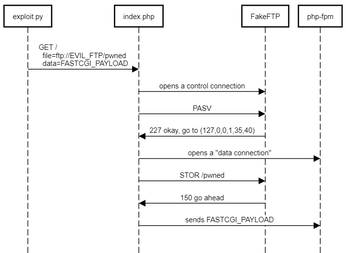

This is the shortest of the web challenges, totaling only five lines in `index.php`:
```php
<?php
$file = $_GET['file'] ?? '/tmp/file';
$data = $_GET['data'] ?? ':)';
file_put_contents($file, $data);
echo file_get_contents($file);
```

That is, we can write arbitrary data to a given file on the server (with `file_put_contents()`) and then read it back with `file_get_contents()`.
The file permission are draconian, though: we are restricted to reading from and writing to `/tmp` only.
The flag is somewhere else, and in order to read it, we are supposed to invoke the sgid `/readflag` binary the challenge authors put in the
Docker container.

There's only so much we can do with files in `/tmp` (we certainly can't run arbitrary binaries this way), but the `file_*_contents()`
functions in PHP support [more](https://www.php.net/manual/en/wrappers.php) than just regular files.
For our evil purposes, the most important thing is they [can](https://www.php.net/manual/en/wrappers.php) fetch URLs:
```php
<?php
    // prints
    // Contact: https://ctftime.org/feedback
    // Contact: mailto:info@ctftime.org
    echo file_get_contents('https://ctftime.org/.well-known/security.txt');
?>
```

Unlike in the other web challenges, the socket that php-fpm listens on is a regular TCP socket, not a UNIX one:
```
fastcgi_pass 127.0.0.1:9000;
```

This suggests we try to reuse our trick from [heiko](https://github.com/dfyz/ctf-writeups/tree/master/hxp-2020/heiko) with a slight modification.
As before, we first save a malicious PHP script that runs `/readflag` to `/tmp/`. After that, since we don't have a shell and can't talk to the PHP socket directly,
we trick `file_*_contents()` into connecting to the socket and sending a FastCGI message that would execute the malicious script.

We can craft such a message in [a few lines of Python](https://github.com/dfyz/ctf-writeups/blob/master/hxp-2020/resonator/exploit.py#L40).
However, because the FastCGI protocol is binary, the hard part is figuring out how to deliver it over the socket. We decided to implement a fake FTP server (again, [a small Python script](https://github.com/dfyz/ctf-writeups/blob/master/hxp-2020/resonator/fake_ftp.py))
that redirects PHP to `127.0.0.1:9000` when `file_put_contents()` is called and PHP tries to open a data connection in passive mode.

Here's how it works:



The only minor detail remaining is how to send the flag to us after spawning `/readflag` because `file_put_contents()` that talks to FTP
obviously won't send anything back to the client. Our PHP payload saves the flag in `/tmp/whatever` and makes it readonly:
```php
<?php shell_exec("/readflag > /tmp/{FLAG_TXT_ID}.txt && chmod 444 /tmp/{FLAG_TXT_ID}.txt"); ?>
```

This means that the flag can't be overwritten by `file_put_contents()` and we can retrieve it simply with `GET /index.php?file=/tmp/whatever`.
Combining all the pieces, we run [the exploit](https://github.com/dfyz/ctf-writeups/blob/master/hxp-2020/resonator/exploit.py) and finally get what we want:
```
PS> python .\exploit.py [REDACTED_IP]
hxp{I_hope_you_did_not_had_to_read_php-src_for_this____lolphp}
```
